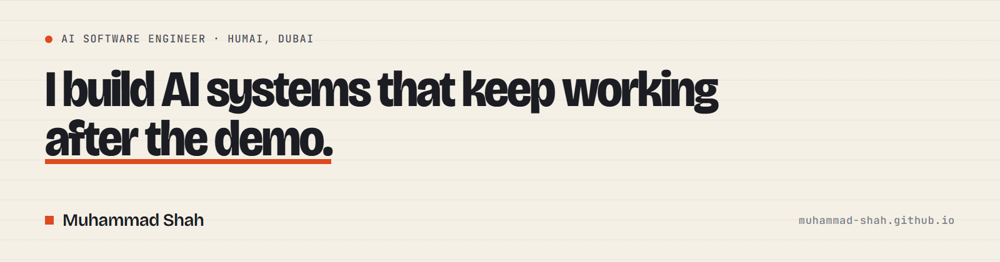

# Muhammad Shah

**AI Software Engineer at [HumAI](https://humai.ae/), Dubai.** I build production agentic systems — LangGraph and DSPy orchestration, RAG and knowledge graphs, voice agents — and the benchmarking, regression testing and monitoring that keep language-model systems dependable once they are live.

Co-author of *Instrumentation-Free Continuous Monitoring of Deployed LLM Applications Using Auto-Generated Grounded Benchmarks* (submitted to ICEAI 2026).

[Portfolio](https://muhammad-shah.github.io/) · [LinkedIn](https://www.linkedin.com/in/muhammad10) · [engr.mu.shah@gmail.com](mailto:engr.mu.shah@gmail.com)

## What I'm building

Principal contributor to **Huscribe**, HumAI's AI platform: five production services in Python and FastAPI, orchestrated with LangGraph and DSPy, released continuously to Google Kubernetes Engine.

- **Talk to your CRM** — automatic field resolution and record normalisation across Salesforce, HubSpot and Zoho, conversational intent routing, and deal-health and lead-scoring pipelines, with per-task model routing.
- **Knowledge base** — a three-stage agent compiles each document into cited, cross-linked pages; an index-guided retriever answers from only the pages it needs, so every answer traces to a source.
- **ContextGraph** — a multi-tenant customer knowledge graph over Slack, Salesforce, Zendesk and Shopify, with entity extraction and cross-system identity resolution.
- **Speech evaluation** — led the Arabic and English ASR benchmark (WER and CER on standard corpora and real dictations) that chose the production transcription model; the incumbent varied between 11.5% and 15.7% WER run to run.
- **Prompt optimisation** — DSPy MIPRO across nine coaching agents: +35% personalisation, +28% actionability and +31% conflict resolution against hand-written prompts.
- **Voice and documents** — the voice interviewer for HumAI's recruitment platform, and a legal-translation agent for Mairit that takes PDF, Word and scanned contracts through to structured, reviewable output.

## GitHub activity

  

<picture>
  <source media="(prefers-color-scheme: dark)" srcset="https://quotes-github-readme.vercel.app/api?type=horizontal&theme=dark">
  
</picture>

<picture>
  <source media="(prefers-color-scheme: dark)" srcset="https://github-profile-summary-cards.vercel.app/api/cards/profile-details?username=Muhammad-Shah&theme=github_dark">
  
</picture>

<picture>
  <source media="(prefers-color-scheme: dark)" srcset="https://streak-stats.demolab.com?user=Muhammad-Shah&disable_animations=true&hide_border=true&theme=github-dark-blue&background=0d1117">
  
</picture>

<picture>
  <source media="(prefers-color-scheme: dark)" srcset="https://github-profile-summary-cards.vercel.app/api/cards/stats?username=Muhammad-Shah&theme=github_dark">
  
</picture>
<picture>
  <source media="(prefers-color-scheme: dark)" srcset="https://github-profile-summary-cards.vercel.app/api/cards/productive-time?username=Muhammad-Shah&theme=github_dark&utcOffset=4">
  
</picture>

<picture>
  <source media="(prefers-color-scheme: dark)" srcset="https://github-profile-summary-cards.vercel.app/api/cards/repos-per-language?username=Muhammad-Shah&theme=github_dark">
  
</picture>
<picture>
  <source media="(prefers-color-scheme: dark)" srcset="https://github-profile-summary-cards.vercel.app/api/cards/most-commit-language?username=Muhammad-Shah&theme=github_dark">
  
</picture>

  

<picture>
  <source media="(prefers-color-scheme: dark)" srcset="https://profile-trophy.vercel.app/?username=Muhammad-Shah&no-frame=true&no-bg=true&column=7&margin-w=8&theme=onestar">
  
</picture>

## Stack

                       

Python · TypeScript · SQL · Dart · FastAPI · Pydantic · LangGraph · LangChain · DSPy · CrewAI · MCP · PyTorch · TensorFlow · Hugging Face · TRL / PEFT / LoRA · RAGAs · ChromaDB · FalkorDB · MongoDB · PostgreSQL · Redis · Docker · Kubernetes · GCP (GKE, Cloud Run, Cloud Build, Vertex AI) · AWS · GitHub Actions · Deepgram · ElevenLabs · Whisper · LiveKit · Pipecat

## Background

- **BSc Computer Software Engineering**, University of Engineering & Technology, Mardan (2021–2025). Final-year project: OBAM-AI, the LLM observability platform behind the ICEAI 2026 submission.
- **AI Developer, MakTek AI** (Sep–Dec 2024) — fine-tuned CodeStral-22B to generate error-free PineScript with a sandboxed compile-feedback loop; built a multi-channel chatbot platform with per-customer knowledge bases.
- **NLP Intern, ITSOLERA** (Jun–Aug 2024) — fine-tuned TinyBERT for sentiment classification; built an e-commerce support assistant on FastAPI and LangChain.
- **DeepLearning.AI** — Generative AI with LLMs · Natural Language Processing · Deep Learning · Machine Learning specializations.
